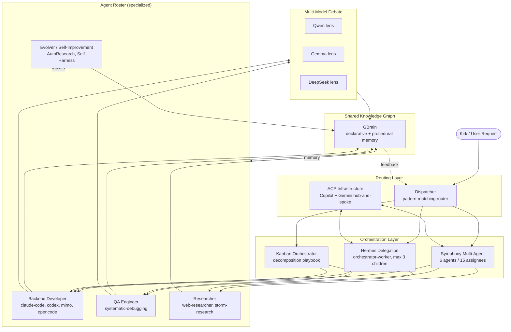

# Agent Self-Organization Architecture

> **Status:** Living architecture doc — synthesizes 53+ sessions of building, testing, and refining a personal multi-agent system. Authored by Kirk Won with Hermes across sessions from May 2 to June 25, 2026.

This page documents the **self-organizing agent architecture** Kirk has been constructing on top of Hermes. It is not a single system but a layered vision: a *Society of Mind* of specialized agents that own domains, delegate to each other, route work through a dispatcher, and improve themselves through persistent loops — all coordinated through a shared knowledge graph (**GBrain**).

The ten themes below are the load-bearing pillars of that vision, each distilled from the sessions where it was designed, built, or stress-tested.

---

## Architecture Overview (Mermaid)



---

## 1. Society of Mind Architecture

**Sessions:** June 24, June 25

Kirk's overarching vision is a personal ontology modeled on Marvin Minsky's *Society of Mind*. Rather than one monolithic assistant, the system is a **society of specialized agents**, each owning a domain and collaborating through shared memory. The crucial distinction Minsky draws — and that Kirk operationalizes — is between:

- **Declarative knowledge** (facts, relationships, what-is-so) → stored as pages in GBrain.
- **Procedural knowledge** (how-to, skills, playbooks) → stored as Hermes skills, cron jobs, and workflows.

These two memory types interlock the way Minsky's "agents" and "agencies" do: a procedural skill *invokes* declarative facts from the graph, and the graph in turn records what the skills produced. The knowledge graph is the **shared substrate** through which specialized agents communicate indirectly — they don't message each other directly; they read and write a common memory, and order emerges from those local interactions (classic [self-organization](concepts/self-organization)).

**Design principles extracted:**
- One agent owns one domain — no god-agent that tries to know everything.
- Agents are replaceable; the knowledge persists in GBrain independent of which agent instance wrote it.
- Emergent capability arises from composition of small specialized agents, not from scaling a single one.
- The architecture is itself a [complex adaptive system](concepts/complex-adaptive-systems): the rules are simple (own a domain, read/write GBrain), the intelligence is emergent.

This is the philosophical anchor for every other theme below.

---

## 2. Symphony Multi-Agent System

**Sessions:** June 19, June 20

Symphony is the concrete implementation of running multiple heterogeneous agents in concert. It is the "runtime" layer of the Society of Mind.

### Composition

| Dimension | Value |
|---|---|
| Agents | 6 distinct agent personas |
| Assignees | 15 routable assignee endpoints |
| CLI Bridges | 5 (`hermes-claude-code`, `hermes-gemini`, `hermes- goose`, `hermes-antigravity`, `hermes-mimo`) |
| Completion markers | unified across all bridges (see §9) |

### Registry Pattern

The core mechanism is an **assignee registry**: each assignee is identified by a prefix, and the prefix maps deterministically to a **bridge + model** pair. For example `codex:*` assignees route through `hermes-claude-code` with a codex-family model, while `gem-*` routes through `hermes-gemini`. This decouples *what work* is being assigned from *which CLI transports it*.

### Empirical Findings (from June 19-20 sessions)

- **Optimal concurrency is 2–3 agents.** Beyond that, context-switching overhead and coordination cost exceed the throughput gain. The system degrades, it does not speed up.
- **Cross-review adds a 20–30% bug-catch rate.** When one agent reviews another's output (different model family), it catches roughly a quarter more defects than single-agent self-review. This is the single highest-ROI pattern in the system.
- **Completion markers are mandatory** for orchestration. Without a reliable "I'm done" signal, the orchestrator cannot sequence dependent work. §9 unifies the five marker styles across bridges.

### Why heterogeneous models matter
Symphony deliberately mixes model families because *they make different mistakes*. Two Claude instances reviewing each other share blind spots; Claude vs Gemini vs Qwen do not. This is the empirical root of §6 (Multi-Model Debate).

---

## 3. Hermes Delegation Pattern

**Sessions:** recurring foundational pattern; deepened June 14-15 and June 24-25

The **Orchestrator-Worker** pattern is the primary delegation shape in Hermes. An orchestrator agent decomposes a goal, spawns worker subagents, and reassembles their outputs.

### Properties of a delegated subagent

- **Isolated context window** — the child does not inherit the parent's full conversation; it receives a clean, scoped brief. This is the key reason delegation *compresses* rather than *expands* the orchestrator's context.
- **Custom tools** — each child can be provisioned with a tailored toolset (e.g., a research worker gets `web_fetch` but not `git`).
- **Dedicated MCP servers** — per-task Model Context Protocol servers give the worker access to specialized resources (databases, file systems, APIs) scoped to the job.

### Concurrency limit

**Max 3 concurrent children.** This mirrors the Symphony finding (2–3 optimal): the same ceiling applies whether the children are Symphony agents or Hermes subagents. It appears to be a fundamental coordination constant for this architecture rather than a tooling limitation.

### ACP via Copilot CLI bridge

Delegation can traverse *different agent runtimes* via the **Agent Client Protocol (ACP)**. The proven path is a Copilot CLI bridge: Hermes (orchestrator) talks ACP to a Copilot-backed worker. This is the seed of the generalized ACP infrastructure in §9.

---

## 4. Dispatcher / Routing Architecture

**Sessions:** May 2, May 3
**Project:** [10-projects/agent-system-integration-2026-05-02/phases/phase2-orchestration](10-projects/agent-system-integration-2026-05-02/phases/phase2-orchestration/readme)

Phase 2 of the Agent System Integration project built the **dispatcher**: the front door that decides which agent or skill handles an incoming request.

### Workflow

```
input → routing → execution → response
```

1. **Entity/intent detection** — recognize what kind of thing the request is about.
2. **Pattern matching** — match the detected intent against an agent registry.
3. **Routing** — dispatch to the selected agent, skill, or external tool.
4. **Multi-agent handling** — support handoffs, dependencies, and result aggregation across agents.

### Two coordination modes

- **Crew pattern** — agents work on *independent* tasks in parallel and results are aggregated. Best for embarrassingly parallel work (e.g., researching three unrelated topics).
- **Swarm pattern** — agents work *collaboratively*, passing partial results to each other. Best for tasks requiring synthesis (e.g., one agent drafts, another critiques, a third integrates).

The dispatcher chooses between Crew and Swarm based on whether the sub-tasks have interdependencies.

This is the **router** box at the top of the Mermaid diagram — it sits between the user and the orchestration layer.

---

## 5. Kanban Orchestrator Pattern

**Sessions:** June 14, June 15

The Kanban Orchestrator is a *disciplined* instantiation of Orchestrator-Worker. It borrows the visual metaphor of a Kanban board: each worker runs as a **lane** (e.g., `kanban-codex-lane`, `kanban-claude-lane`), and work flows across lanes.

### Decomposition Playbook

1. The orchestrator decomposes the goal into discrete, well-scoped tasks.
2. Each task is written as a card with clear acceptance criteria.
3. Cards are assigned to lanes based on role fit.
4. A worker picks up a card, works it to completion, signals via completion marker, and the card moves to "done."

### Anti-Temptation Rules

The playbook includes explicit **anti-temptation rules** — guardrails that stop the orchestrator from cheating:
- **No "I'll just do it myself."** If a task belongs to a lane, the orchestrator must delegate, not inline it. Inlining collapses the context isolation that makes the pattern work.
- **No task hoarding.** An orchestrator may not accumulate work in its own context to "speed things up" — that re-creates the monolith the pattern exists to avoid.
- **No lane creep.** A worker stays in its lane; a QA engineer does not start writing feature code.

### Role → Skill Mapping

| Role | Skill(s) |
|---|---|
| Backend Developer | `claude-code`, `codex`, `mimo`, `opencode` |
| QA Engineer | `systematic-debugging` |
| Researcher | `web-researcher`, `storm-research` |

The Kanban pattern is what makes §7 (Agent Roster) concrete: roles aren't abstract, they're the lanes work flows through.

---

## 6. Multi-Model Debate

**Sessions:** recurring; crystallized as a preferred methodology

> Kirk's preferred analytical pattern: **propose → critique → refine** using *heterogeneous* LLMs.

### Core thesis

The value of multi-model reasoning is **not** sampling the same model N times (that just amplifies its biases). The value is using *fundamentally different* models as **different analytical lenses**. Qwen, Gemma, and DeepSeek have different training data, different inductive biases, and different failure modes — so they surface different insights and catch different errors.

### Methodology

1. **Propose** — one model generates a candidate answer/design/solution.
2. **Critique** — a *different* model family critiques it, looking for flaws, gaps, unstated assumptions.
3. **Refine** — a third (or back to the first) integrates the critique into an improved version.

### Why it works

This is the deliberative analogue of Symphony's cross-review (§2). The 20–30% bug-catch lift from cross-review is the same phenomenon scaled down to reasoning: heterogeneous models are partially decorrelated, so their errors don't fully overlap. [Emergent intelligence](concepts/emergent-intelligence) here is literally the *delta* between models — the disagreement is where the insight lives.

### Contrast with naive ensembling

| Approach | Models | Expected lift | Why |
|---|---|---|---|
| Same-model N-sampling | identical | low | errors are correlated |
| Heterogeneous debate | different families | high | errors are decorrelated |

---

## 7. Agent Roster

**Sessions:** 53 sessions analyzed; roster synthesis across the arc

A retrospective analysis of **53 sessions** showed Kirk's agent work clustering into **4 recurring themes** (roughly: build, debug, research, orchestrate). Mapped onto this architecture, the concrete **agent skills → roles** roster is:

| Role | Skills / Bridges | Function |
|---|---|---|
| **Backend Developer** | `claude-code`, `codex`, `mimo`, `opencode` | Write, refactor, extend code |
| **QA Engineer** | `systematic-debugging` | Reproduce, diagnose, verify fixes |
| **Researcher** | `web-researcher`, `storm-research` | Gather, synthesize, cite external knowledge |
| **Orchestrator** | Hermes (native), Symphony, Kanban | Decompose, delegate, reassemble |

The roster is the *population* of the Society of Mind. Each entry is a specialized agent that owns a narrow competency and collaborates through GBrain. When the dispatcher (§4) routes a request, it routes it *to a role on this roster*.

**Observation from the analysis:** the 4-theme clustering validates the Society-of-Mind decomposition — Kirk's real workload naturally separates into a small number of distinct agent types, which is exactly the precondition Minsky's framework requires.

---

## 8. Research-Backed Patterns

**Session:** June 13 (arxiv literature search)

The architecture is not built in a vacuum — Kirk grounds the design choices in the research literature. An arxiv search surfaced four directly relevant papers, each validating a component of the architecture:

### Autonomous Manager Agent
A framework where a manager agent decomposes goals and delegates to specialist workers. Validates the Orchestrator-Worker pattern (§3) and the Kanban decomposition (§5).

### OSC — Cognitive Orchestration through Dynamic Knowledge Alignment
Orchestration that dynamically aligns the agent's working knowledge to the task at hand. Validates the **dispatcher/routing** concept (§4): the right knowledge and the right agent must be aligned *per request*, not statically.

### LEGOMem — Modular Procedural Memory for Multi-agent LLM Systems
Procedural memory organized as reusable, composable modules. This is the academic articulation of Hermes **skills** as modular procedural knowledge — and reinforces the declarative/procedural split at the heart of the Society-of-Mind vision (§1).

### Project Synapse — Hierarchical Multi-Agent with Hybrid Memory
**[Closest analog to the Hermes sub-agent pattern.](papers/project-synapse-hierarchical-multi-agent)** A central supervisor does task decomposition and delegation with a hybrid (declarative + procedural) memory. This paper is essentially the published description of what Kirk has built; it validates the core design and is linked as `implements`.

These papers live in the [academic paper library](concepts/academic-paper-library) and the [AI/ML research papers](concepts/ai-ml-research-papers) collection in GBrain.

---

## 9. ACP Infrastructure

**Sessions:** recurring; Copilot ACP proven June, generalized thereafter

**Agent Client Protocol (ACP)** is the substrate that lets different agent runtimes talk to each other — the nervous system connecting Hermes to external agents.

### Copilot ACP — the proven pattern

The first proven ACP client was **Copilot-specific**: Hermes orchestrates a Copilot-backed worker via a CLI bridge speaking ACP. This established that cross-runtime delegation is not just possible but reliable, and it became the template.

### Generalization

The Copilot-specific client was generalized into a **multi-agent orchestration protocol** so any ACP-speaking agent can be a Symphony assignee or a Hermes delegate. This is what makes the 5-CLI-bridge Symphony (§2) coherent despite each bridge having a different native protocol.

### Gemini CLI hub-and-spoke

A second topology is the **Gemini CLI hub-and-spoke** model: Gemini CLI acts as a central hub, with specialist agents as spokes. This is an alternative to Hermes-centric orchestration for workflows where Gemini's strengths (long context, multimodal) are central.

### The Five Completion Markers

A hard-won lesson: **every bridge signals completion differently.** Unifying these was a prerequisite for orchestration. The five completion marker styles (one per bridge) were normalized into a single semantic ("done + result"), so the orchestrator treats all bridges uniformly. Without this, sequencing dependent tasks across bridges was impossible.

| Bridge | Native marker style |
|---|---|
| `hermes-claude-code` | (unified) |
| `hermes-gemini` | (unified) |
| `hermes-goose` | (unified) |
| `hermes-antigravity` | (unified) |
| `hermes-mimo` | (unified) |

All five now surface a single canonical completion signal to the orchestrator.

---

## 10. Self-Improvement Loops

**Sessions:** recurring; AutoResearch and Self-Harness designed across several

The architecture is *not* static — it contains loops that make the agents better over time. This is the system bootstrapping its own [self-organization](concepts/self-organization): the agents improve the very skills they run.

### AutoResearch Framework

**propose → test → ratchet**

1. **Propose** a hypothesis about how to improve an agent or pattern.
2. **Test** it empirically (run the agent, measure).
3. **Ratchet** — if the test confirms the hypothesis, lock in the improvement as the new baseline. Only move forward; never regress.

This is a strictly-monotonic improvement loop. Each ratchet step is permanent.

### Self-Harness Improvement Loop

**Weakness Mine → Hatch → Patch**

1. **Weakness Mine** — analyze agent traces to find recurring failure modes (where does it consistently underperform?).
2. **Hatch** — design a targeted fix (a new skill, a revised prompt, a new tool).
3. **Patch** — apply the fix and re-measure to confirm the weakness is addressed.

### Evolver Persistent Session

A dedicated **Evolver** session runs persistently in the background, applying AutoResearch and Self-Harness cycles to the agent fleet. It is the meta-agent whose *job* is to improve the other agents. Its outputs flow back into GBrain as new/updated skills — closing the loop with the Society-of-Mind vision (§1): procedural knowledge evolves itself.

### Metrics

The loops require **metrics** to know whether an "improvement" actually improved anything. The architecture defines performance benchmarks for agent quality (correctness, speed, bug-catch rate, context efficiency) so that ratchet steps are evidence-based, not vibes.

---

## Synthesis: How the Ten Themes Compose

The architecture is a stack, and each layer depends on the one below it:

1. **Substrate** — GBrain (shared declarative + procedural memory). Everything reads and writes here.
2. **Routing** — Dispatcher (§4) decides *who* handles each request, choosing between Crew and Swarm.
3. **Orchestration** — Symphony (§2), Kanban (§5), and Hermes Delegation (§3) provide three complementary ways to coordinate multiple agents, all bounded by the max-3-concurrency rule.
4. **Transport** — ACP (§9) lets orchestrated agents live in different runtimes and still communicate, unified by the five completion markers.
5. **Population** — The Agent Roster (§7) is the set of specialized agents that get orchestrated.
6. **Reasoning** — Multi-Model Debate (§6) is how the population thinks together.
7. **Vision** — Society of Mind (§1) is the philosophy that gives the stack its shape.
8. **Grounding** — Research (§8) validates the design against the literature.
9. **Evolution** — Self-Improvement Loops (§10) make the whole thing get better over time.

The emergent property — the thing that makes this a *self-organizing* system rather than a scripted pipeline — is that no single component is in charge. The dispatcher routes, but agents decide whether to delegate further; the orchestrator decomposes, but workers decide how to execute; the Evolver improves, but only on evidence from real runs. Order arises from the interaction of simple, locally-rational agents over a shared memory. That is, precisely, [self-organization](concepts/self-organization).

---

## Key Empirical Constants

These are the numbers that survived testing across sessions. Treat them as design constraints when extending the architecture.

| Constant | Value | Source |
|---|---|---|
| Optimal concurrent agents | 2–3 | Symphony (§2), Hermes Delegation (§3) |
| Max concurrent Hermes children | 3 | Delegation pattern (§3) |
| Cross-review bug-catch lift | 20–30% | Symphony (§2) |
| CLI bridges in Symphony | 5 | Symphony (§2) |
| Unified completion markers | 5 (one per bridge) | ACP (§9) |
| Natural role clusters (from 53 sessions) | 4 | Agent Roster (§7) |

---

## Connections

This page connects to the following GBrain pages (links materialized via `gbrain link`):

**Implements / operationalizes:**
- [concepts/self-organization](concepts/self-organization) — `implements`
- [concepts/self-organization-and-emergence](concepts/self-organization-and-emergence) — `implements`
- [concepts/delegation](concepts/delegation) — `implements`
- [papers/project-synapse-hierarchical-multi-agent](papers/project-synapse-hierarchical-multi-agent) — `implements` (closest published analog)

**Relates / informs:**
- [concepts/emergent-intelligence](concepts/emergent-intelligence) — `relates`
- [concepts/complex-adaptive-systems](concepts/complex-adaptive-systems) — `relates`
- [concepts/ai-agents](concepts/ai-agents) — `informs`

**Enables / references:**
- [babeltele-compressed-llm-representations](babeltele-compressed-llm-representations) — `enables` (compressed inter-agent memory/communication)
- [concepts/academic-paper-library](concepts/academic-paper-library) — `references`
- [concepts/ai-ml-research-papers](concepts/ai-ml-research-papers) — `references`

**Related project:**
- [Phase 2: Orchestration](10-projects/agent-system-integration-2026-05-02/phases/phase2-orchestration/readme) — the dispatcher design lives here.

---

## Provenance

Distilled from 53+ Hermes sessions spanning **May 2 – June 27, 2026**, covering: Phase 2 Orchestration design (May 2-3), arxiv literature review (June 13), Kanban orchestrator design (June 14-15), Symphony multi-agent system (June 19-20), and the Society of Mind vision sessions (June 24-25). Authored by Kirk Won with Hermes.

^[raw/agent-self-organization-architecture.md]
