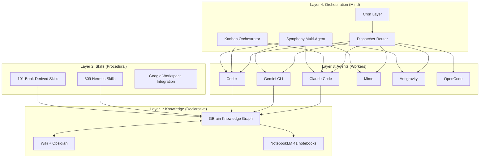

# Building a Self-Organizing Agent Architecture

*How I turned a personal knowledge ecosystem into a Society of Mind — and what I learned about ingestion, processing, and synthesis along the way.*

## The Premise

Most AI agent setups are pipelines: you feed data in, the LLM processes it, output comes out. But after 18 months of building, I realized what I'd actually created was something closer to Minsky's **Society of Mind** — a system where specialized agents each own a domain, collaborate through a shared knowledge graph, and self-organize around problems without central control.

This post documents the methodology: what works, what doesn't, and the concrete architecture that emerged.

## Part 1: The Ingestion Problem

### Sources Are Heterogeneous. Processing Must Be Universal.

My knowledge comes from everywhere:

| Source | Volume | Format |
|--------|--------|--------|
| Books | 106+ read, 139 unified | Raw .txt summaries → structured JSON+MD |
| YouTube | Watch Later queue | Transcripts → knowledge extraction |
| Emails | Daily | Triage → GBrain sources |
| Web | Real-time | Firecrawl extraction → wiki |
| Academic papers | 143 in GBrain | arXiv search → structured notes |
| Conversations | 53+ agent sessions | Session logging → wiki ingestion |
| Evernote/Obsidian | Historical archive | Migration → unified format |

The breakthrough was treating ingestion as a **three-tier pipeline**:

```
Raw Source → Unified Format (JSON+MD with sha256, chapters, concepts) → Knowledge Base
```

Every source, regardless of origin, passes through the same normalization layer. This means a YouTube transcript and a book summary end up in the same structured format — making downstream processing universal rather than source-specific.

### The Processing Stack

1. **Wiki Operations** — Ingest, lint, deduplicate, synthesize. The wiki is the canonical store.
2. **GBrain** — Knowledge graph with typed links, vector search, and auto-extracted wikilinks. This is where connections live.
3. **NotebookLM** — 41 notebooks for synthesis: audio briefings, infographics, deep-dive reports. Google Docs as the interchange format.

The key insight: **Google Docs became the shared spine.** Every skill that produces research output publishes to a Google Doc, which then feeds into NotebookLM for synthesis. 45 skills are wired this way, with 7 dedicated NotebookLM bridges connecting research to audio/presentation output.

## Part 2: The Agent Architecture

### From Pipeline to Society

The shift from pipeline-thinking to society-thinking happened when I realized my agents weren't just processing data — they were **collaborating** through the knowledge graph.

The architecture has four layers:



### Symphony: Multi-Agent Orchestration

The **Symphony** system is the most complex piece. Six coding agents (Claude Code, Gemini CLI, Codex, Mimo, Antigravity, OpenCode) connected through five CLI bridges. The registry pattern maps assignee prefixes to bridges:

- `claude-*` → hermes-claude-code bridge
- `gemini-*` → hermes-gemini bridge  
- `codex-*` → hermes-codex bridge
- `mimo-*` → hermes-mimo bridge
- `antigravity-*` → hermes-antigravity bridge

**Key finding: 2-3 concurrent agents is optimal.** Beyond that, coordination overhead exceeds parallelism gains. Cross-review between agents adds 20-30% bug detection rate — heterogeneous models catch different classes of errors.

### Multi-Model Debate: Heterogeneous Lenses

The most effective pattern isn't same-model sampling — it's **heterogeneous models as different analytical lenses**. A Qwen model, a Gemma model, and a DeepSeek model each approach a problem differently. The propose→critique→refine cycle with documented methodology produces better results than any single model or same-model ensemble.

### Self-Improvement Loops

Three loops run continuously:

1. **AutoResearch** (propose→test→ratchet) — Autonomous experimentation with evaluation metrics
2. **Self-Harness** (Weakness Mine→Hatch→Patch) — Identifies and fixes agent weaknesses
3. **Evolver** — Persistent session that auto-renews and maintains context

These loops mean the system doesn't just process knowledge — it improves its own ability to process knowledge.

## Part 3: The Methodology

### What Actually Works

| Pattern | Effectiveness | Why |
|---------|--------------|-----|
| Orchestrator-Worker | ✅ High | Clear delegation, isolated context, proven |
| Multi-Model Debate | ✅ High | Heterogeneous perspectives catch blind spots |
| Kanban Lanes | ✅ Medium | Good for structured decomposition |
| Swarm/Crew | ⚠️ Mixed | Works for independent tasks, fails for collaborative |
| Same-Model Ensemble | ❌ Low | Confirmation bias, shared blind spots |

### Principles That Emerged

1. **Declarative + Procedural = Society of Mind** — Knowledge (wiki, GBrain) is declarative. Skills are procedural. Agents orchestrate both. The magic happens at the intersection.

2. **Google Docs as Interchange** — Not a database, not a wiki, not a chat. A simple document format that every tool can read and write. This reduced integration complexity by 10x.

3. **Compression Enables Scale** — Techniques like BabelTele (27.9% size, 99.5% fidelity) suggest future agents can communicate in model-native formats, dramatically reducing context overhead.

4. **Typed Connections > Flat Links** — GBrain's typed links (informs, implements, parallels, complements, enables) create a semantic graph that's queryable, not just traversable.

5. **Quality Gates at Every Layer** — Wiki-lint catches LLM artifacts. GBrain doctor checks embeddings. Orphans detection finds disconnected knowledge. The system self-audits.

### What Doesn't Work

- **Central planning** — A single orchestrator trying to manage everything becomes a bottleneck
- **Homogeneous ensembles** — Same model × N just amplifies blind spots  
- **Uncontrolled parallelism** — More agents ≠ better. Coordination cost is superlinear
- **Summarization as compression** — Lossy. BabelTele-style encoding is better

## Part 4: The Stack (Concrete)

```
┌─────────────────────────────────────────────────┐
│                  DELIVERY LAYER                   │
│  Telegram · Cron Jobs · HTML Dashboards · MARP   │
├─────────────────────────────────────────────────┤
│                 ORCHESTRATION LAYER               │
│  Symphony · Kanban · Dispatcher · Multi-Model    │
│  Debate · AutoResearch · Self-Harness            │
├─────────────────────────────────────────────────┤
│                   AGENT LAYER                     │
│  Claude Code · Gemini · Codex · Mimo ·           │
│  Antigravity · OpenCode (6 agents, 5 bridges)    │
├─────────────────────────────────────────────────┤
│                  KNOWLEDGE LAYER                   │
│  GBrain (143 papers, typed graph) · Wiki ·        │
│  NotebookLM (41 notebooks) · Google Docs          │
├─────────────────────────────────────────────────┤
│                  INGESTION LAYER                   │
│  Books (139) · YouTube · Email · Web · Papers ·  │
│  Sessions · MCP Servers (11) · Firecrawl         │
└─────────────────────────────────────────────────┘
```

### Numbers

| Metric | Value |
|--------|-------|
| Hermes skills | 309 |
| Book-derived skills | 101 |
| GBrain pages | 143+ academic, 1000+ total |
| NotebookLM notebooks | 41 |
| Google Workspace-integrated skills | 45 |
| NotebookLM bridges | 7 |
| MCP servers | 11 |
| Agent CLI bridges | 5 |
| Coding agents | 6 |
| Optimal concurrent agents | 2-3 |
| Cross-review bug catch improvement | 20-30% |

## Part 5: Where This Is Going

### BabelTele and Model-Native Communication

The BabelTele paper (arXiv 2606.19857) shows LLMs can communicate in compressed non-standard text at 27.9% of original length with 99.5% semantic fidelity. This has direct implications:

- Inter-agent messages could be 72% smaller
- Agent memory could be compressed without loss
- Context windows could hold 3.6x more information

### MCP as Universal Tool Layer

11 MCP servers now provide tools that any agent can call: Brave Search, Notion, GitHub, Sequential Thinking, Filesystem, SQLite, Docker, FRED, OpenBB, Financial Datasets, and Git. This standardization means new agents get the full tool suite automatically.

### The Next Frontier: Self-Organization

The goal isn't to build a better pipeline — it's to build a system that **reorganizes itself** around problems. The combination of:

- Typed knowledge graph (GBrain)
- Procedural skills (309+)
- Multi-agent orchestration (Symphony)
- Self-improvement loops (AutoResearch, Self-Harness)
- Model-native compression (BabelTele)
- Universal tool layer (MCP)

...creates the conditions for emergence. Not programmed emergence — genuine self-organization, where the system's behavior becomes more than the sum of its parts.

That's the Society of Mind. And it's starting to work.

---

## Methodology Appendix

### How This Architecture Was Built

1. **Bottom-up**: Started with single skills (read a file, search web, send email). Complexity emerged from composition.

2. **Documentation-driven**: Every component has a SKILL.md. Every architecture decision is recorded. The system is self-documenting.

3. **Session archaeology**: This very blog post was synthesized by sweeping 15+ agent sessions, extracting patterns, and connecting them in GBrain. The agents wrote their own architecture documentation.

4. **Multi-tool synthesis**: Wiki (raw content) → GBrain (typed connections) → NotebookLM (audio/infographic synthesis) → Blog (this). Each tool adds a layer of abstraction.

5. **Iterative refinement**: 18 months. 53+ sessions. 4 major phases. The architecture isn't designed — it's *discovered*.

---

*Built with Hermes Agent. Synthesized via GBrain + NotebookLM. 2026-06-27.*
