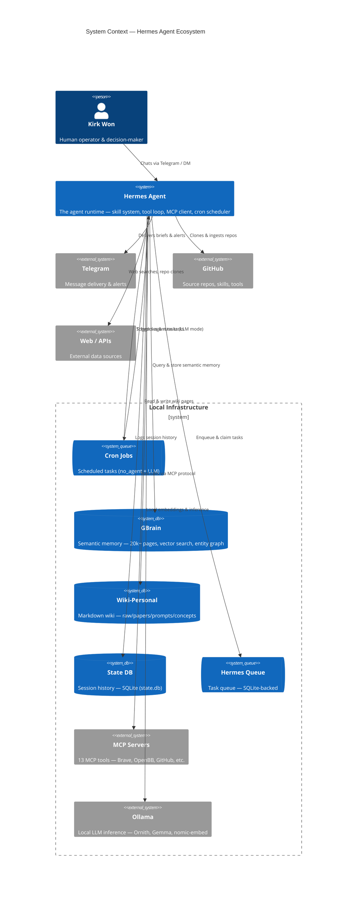
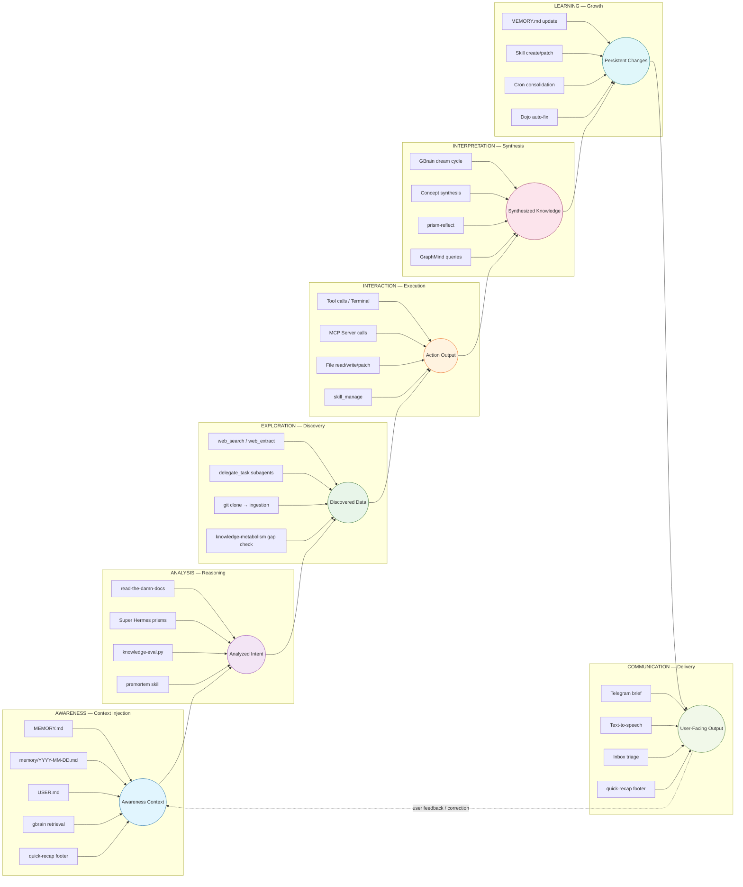
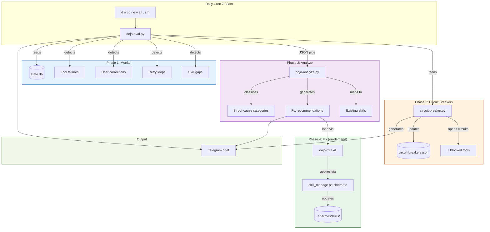
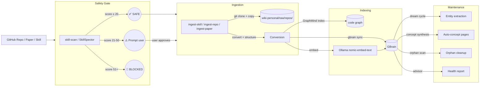
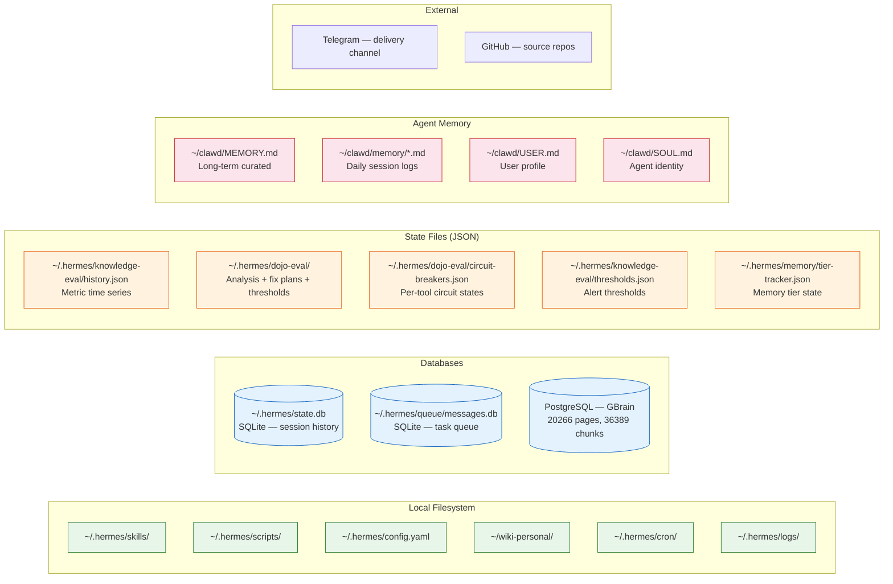
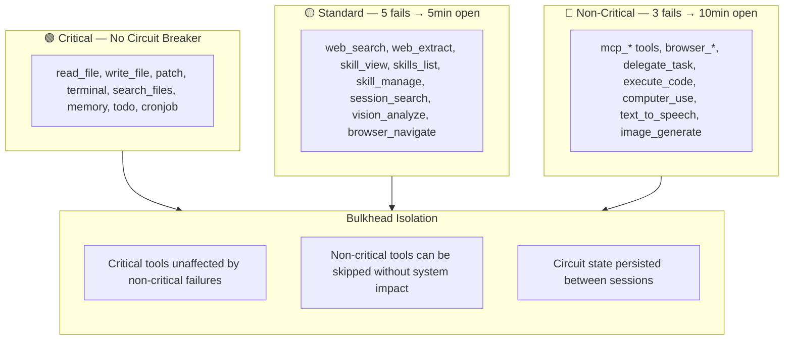

# Hermes Agent System Architecture

Comprehensive architecture covering data pipelines, processes, and data storage. Mermaid diagrams that render in GitHub, Notion, Obsidian, and any Mermaid-compatible viewer.

> **See also:** [[concepts/hermes-agent-stack]] for the cognitive DAG (awareness → analysis → exploration → interaction → interpretation → learning → communication). This document adds the infrastructure layer.

---

## 1. System Context (C4 Level 1)



---

## 2. Data Pipeline — Full DAG

The cognitive stack as a data pipeline, annotated with storage points and data formats.



---

## 3. Processes

### 3.1 Dojo Pipeline — Auto Self-Improvement



### 3.2 Ingestion Pipeline — Repo → Wiki → GBrain



### 3.3 Cron Cascade

```mermaid
flowchart TD
  subgraph Every_180m["Every 180m"]
    L1[LLm-wiki → GBrain delta sync]
    L2[symphony-dispatch + collect]
  end

  subgraph Daily["Daily"]
    D0[GBrain Live Sync - 3:00am]
    D1[GBrain Daily Backup - 3:00am]
    D2[Token Usage Log - 2:00am]
    D3[GBrain Nightly Dream - 2:00am]
    D4[Backup Integrity Verify - 3:05am]
    D5[Project Dashboard Sync - 6:00am]
    D6[SPCX Monitor - 6:30am wkdays]
    D7[Morning Briefing - 7:00am]
    D8[Knowledge Eval - 8:00am]
    D9[Inbox Triage - 7/12/21]
    D10[Market Close Summary - 1:05pm wkdays]
    D30[Dojo Eval - 7:30am]
  end

  subgraph Weekly["Weekly"]
    W1[GBrain Weekly Health - Mon 6am]
    W2[Weekly Maintenance - Mon 2am]
    W3[Weekly Hedge Signal - Mon 9am]
    W4[Weekly Macro Brief - Mon 9am]
    W5[Weekly Questions Scan - Mon]
    W6[Stale Page Watchdog - Mon 10am]
    W7[Memory Tier Demotion - Sun 9am]
    W8[Weekly Review - Sun 6pm]
    W9[Comprehension Debt - Mon 9am]
    W10[IPO Catalyst Scan - Sat 7am]
  end

  subgraph Monthly["Monthly"]
    M1[GBrain Monthly Review - 1st 4am]
    M2[GBrain Quarterly Cleanup - 1st 5am]
    M3[Cron Monthly Audit - 1st 8am]
  end

  Every_180m --> Daily
  Daily --> Weekly
  Weekly --> Monthly

  style Daily fill:#e3f2fd,stroke:#1565c0
  style Weekly fill:#f3e5f5,stroke:#7b1fa2
  style Monthly fill:#fff3e0,stroke:#e65100
```



---

## 4. Data Storage

### 4.1 Storage Map



### 4.2 Data Volume & Freshness

```mermaid
flowchart TD
  subgraph Size["Storage Size Estimates"]
    SS10[~2 MB — state.db (SQLite session store)]
    SS11[~50 KB — queue DB]
    SS12[~300 MB — GBrain PostgreSQL (20k pages, 36k chunks, vectors)]
    SS13[~5 MB — wiki-personal markdown files]
    SS14[~100 KB — skills + scripts + config]
  end

  subgraph Freshness["Update Cadence"]
    FR1[state.db — every tool call (continuous)]
    FR2[GBrain — 180m sync + nightly dream cycle]
    FR3[Memory files — per session]
    FR4[Circuit breakers — per dojo eval run (7:30am)]
    FR5[Eval history — daily (8:00am)]
  end

  subgraph Criticality["Backup Status"]
    BK1[GBrain — daily backup script ✓]
    BK2[Wiki — git versioned ✓]
    BK3[state.db — not backed up ⚠️]
    BK4[Config — git versioned ✓]
    BK5[Skills — git versioned ✓]
  end
```

---

## 5. Tool Tiers & Reliability



---

## 6. Related Documents

- [[concepts/hermes-agent-stack]] — Cognitive DAG (awareness → communication)
- [[concepts/knowledge-metabolism]] — 3D cube model for knowledge health
- [[concepts/self-maintaining-knowledge-base]] — KB auto-maintenance
- [[concepts/super-hermes-prisms]] — Analytical prism system
- [dojo-fix skill](~/.hermes/skills/dojo-fix/SKILL.md) — Fix application skill
- [circuit-breaker.py](~/.hermes/scripts/circuit-breaker.py) — Circuit breaker + bulkhead implementation
- [dojo-eval.py](~/.hermes/scripts/dojo-eval.py) — Session failure monitor
- [dojo-analyze.py](~/.hermes/scripts/dojo-analyze.py) — Root cause analysis + fix recommendations
- [GBrain architecture](~/.gbrain/) — Semantic memory system
