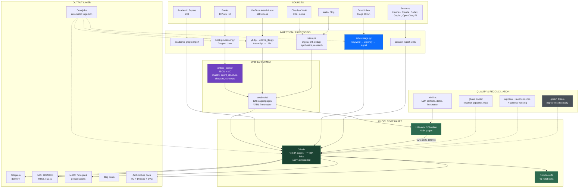
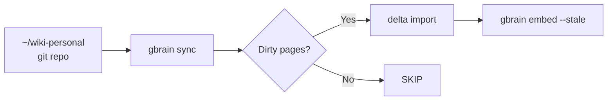

# Knowledge Ingestion & Processing Architecture

**Owner:** Kirk Won
**Canonical doc:** `/Users/kirkwon/wiki-personal/knowledge-ingestion-processing-architecture.md`
**Companion:** [`~/clawd/media-ingestion-architecture.md`](file:///Users/kirkwon/clawd/media-ingestion-architecture.md) (8-pipeline deep dive) · [`agent-self-organization-architecture`](agent-self-organization-architecture) (sibling architecture)
**Scope:** Everything built and learned across sessions (May 3 → June 2026) describing how knowledge enters the system, gets processed, and is surfaced — distilled into one canonical reference.

> This page supersedes three earlier infographic snapshots (`pipeline-architecture`, `knowledge-ecosystem`, `system-map`) which captured point-in-time state. This is the living architecture.

---

## TL;DR

The system is a **many-sources-in, many-surfaces-out** knowledge graph. Content flows from heterogeneous sources (books, YouTube, academic papers, email, Obsidian, web, sessions) through specialized ingestion processors into a central **GBrain** knowledge graph, which then fans out to synthesis surfaces (**NotebookLM**, **LLM-Wiki / Obsidian**, **MARP presentations**, **HTML dashboards**, **Telegram**, **infographics**). A quality + reconciliation layer runs continuously to keep the graph healthy, and a cron-driven automation layer makes the whole loop self-sustaining.

| Layer | Count (Jun 2026) | Notes |
|-------|------------------|-------|
| GBrain pages | ~19,800 | 100% embedded |
| GBrain links | ~44,800 | grown via nightly dream cycle |
| Raw book summaries | 107 | 3-tier pipeline → 120 wiki `raw/books/` |
| Unified book files | 139 | JSON + MD, with `agent_structure` |
| YouTube videos ingested | 698 | Watch Later → transcript → knowledge |
| Academic papers | 239 | `type:paper` in GBrain |
| NotebookLM notebooks | 41 | 5 auto-synced via `nlm` |
| Skills w/ GWorkspace | 45 | `gworkspace.py` interchange |
| Active cron jobs | ~28 | 89% are `no_agent` (zero token burn) |

---

## Full Pipeline (Mermaid)



---

## 1. Three-Tier Book Pipeline (May 3 session)

The canonical reference pipeline. Books move through three tiers, each adding structure.

```
107 raw book summaries (.txt)
        │  book-processor.py (3-agent crew)
        ▼
139 unified JSON + MD files  ── sha256, agent_structure, chapters, concepts
        │  wiki-ingest.py
        ▼
120 wiki-personal/raw/books/ files  ── YAML frontmatter → GBrain → wiki pages
```

**Tier 1 — Raw:** `.txt` summaries, unstructured. Source of truth for content.

**Tier 2 — Unified (`unified_books/`):** Each book becomes a JSON + MD pair. The JSON carries:
- `metadata` (title, author, category, year, tags, `hermes_skill`)
- `agent_structure` (`skill_name`, `when_to_use_trigger`, `tools_used`, `timeline_behavior`, `how_to_measure_improve`, `when_to_stop`)
- `summary`, `chapters`, `concepts`
- `sha256` content hash for dedup / integrity

**Tier 3 — LLM-Wiki raw sources (`raw/books/`):** YAML frontmatter transforms each book into a graph-ready page:

```yaml
---
source_type: book
title: A Template for Understanding Big Debt Crises - Ray Dalio
author: Ray Dalio
year: 2024
category: general
chapters: 9
concepts: 9
ingested: 2026-05-03
sha256: bd1535e32ffbb89c06bcdd6a7e8cf461424a35a2503acc3e594eb5116da3cb0e
type: framework
created: '2026-05-14'
---
```

**From here:** `raw/books/` → GBrain (`type:book`, 110 pages) → wiki entities/concepts/comparisons → NotebookLM research migration.

**Known gap:** ~94% of chapters have placeholder titles with empty descriptions (raw sources lacked chapter-level detail). Future fix: re-run `book-processor.py enhance` from raw `.txt`.

---

## 2. Knowledge Pipeline Architecture (May 3 & May 10)

End-to-end architecture spanning **sources → ingestion/processing → knowledge bases → output**.

**Sources:** Books · Videos (YouTube) · Evernote · Obsidian · Web · Email · Sessions.

**Ingestion/Processing:** Each source has a dedicated processor (see §1–§6, §11). The unifying insight is **phase-based processing** (extract → summarize → import) beats monolithic one-shot ingestion.

**Knowledge Bases (the three-way store):**
- **GBrain** — canonical knowledge graph (Supabase + pgvector). ~19.8K pages, ~44.8K links, 100% embedded. Hybrid search (RRF + expansion).
- **LLM-Wiki / Obsidian** — human + agent-readable markdown vault (`~/wiki-personal/`, 488+ pages). Synced to GBrain via delta cron.
- **NotebookLM** — synthesis surface for audio briefings, reports, infographics. 41 notebooks.

**Output:** Cron jobs (automated ingestion) · Telegram (delivery) · Dashboards (HTML/D3 visualization) · MARP (presentations) · Blog posts · Architecture docs.

The full Mermaid diagram above (§"Full Pipeline") is the authoritative rendering of this architecture; a point-in-time version was first captured May 10 as `infographic/pipeline-architecture`.

---

## 3. Media Ingestion Architecture (June 7 & June 17)

A detailed **8-pipeline** deep dive lives at [`~/clawd/media-ingestion-architecture.md`](file:///Users/kirkwon/clawd/media-ingestion-architecture.md). This § summarizes it; that file is authoritative for per-pipeline detail.

**The 8 pipelines:**

| # | Pipeline | Input | Output | Status |
|---|----------|-------|--------|--------|
| 1 | Book Ingestion | 107 raw `.txt` | GBrain `type:book` 110 pages | ✅ 107/107 matched |
| 2 | YouTube Video | 698 Watch Later | GBrain `type:video` 66 pages | ✅ 98.2% quality |
| 3 | Academic Papers | arXiv/HF URLs | GBrain `type:paper` 239 | ✅ |
| 4 | Inbox Triage & Signal Routing | Gmail IMAP 60min | GBrain + Q01–Q06 tags | ✅ self-tuning |
| 5 | LLM-Wiki → GBrain Sync | 488+ wiki pages | delta import every 180min | ✅ no_agent |
| 6 | GBrain Nightly Dream | cron 2am | ~2K new links/night | ✅ active |
| 7 | Session History Backfill | session SQLite (FTS5) | reviews + GBrain decisions | ⚡ weekly |
| 8 | Symphony Kanban | cron 5min | Gemini CLI workers | ✅ active |

Plus **NotebookLM sync** (5 notebooks) and a **3-tier query escalation** (GBrain ~2s → NotebookLM ~10s → Deep Research ~5min).

**Versioned architecture docs** — diagrams are kept in sync across four formats so they're version-control friendly:

| Format | File | Purpose |
|--------|------|---------|
| Mermaid (inline `.md`) | `media-ingestion-architecture.md` | Quick reference, renders on GitHub |
| Draw.io (`.drawio`) | `media-ingestion-architecture.drawio` | Canonical editable diagram |
| Excalidraw (`.excalidraw`) | `media-ingestion-architecture.excalidraw` | Hand-drawn aesthetic |
| SVG (export) | `media-ingestion-architecture-overview.svg` | Rendered preview |

**Build script:** `clawd/scripts/build-arch-diagram.py` — regenerates the Draw.io diagram programmatically (shapes, orthogonal connectors, layer styling) and re-exports SVG/PNG. `scripts/build-excalidraw.py` does the same for the Excalidraw variant. Workflow: edit Mermaid in `.md` **and** rebuild Draw.io **and** rebuild Excalidraw.

---

## 4. Media Pipeline Recap

The end-to-end book/media journey, codified as the skill **`media-pipeline-architecture-recap`**:

```
Books → unified_books → GBrain → LLM-wiki → NotebookLM → MARP
```

**Stages & operations:**
- **Reconciliation** — keep GBrain ↔ wiki ↔ sources consistent (`reconcile-links`, `check-backlinks`).
- **Quality audits** — `wiki-lint` catches LLM artifacts, placeholder dates, malformed frontmatter; `score_videos.py` validates title-content alignment (98.2% PASS).
- **YouTube batch processing** — phase-based: extract (yt-dlp) → summarize (OpenRouter/ollama) → import (GBrain). Title-validation loop feeds failures back for re-summarization.
- **Cron conversions** — `no_agent` scripts convert raw → unified → wiki → GBrain on schedule, zero token burn.

This recap exists as a Hermes skill so any session can reload the full pipeline context on demand.

---

## 5. YouTube Knowledge Pipeline

```
YouTube Watch Later → yt-dlp transcripts → knowledge extraction → wiki ingestion
```

- **Scripts:** `~/Downloads/youtube-knowledge-pipeline/` (watch-later export → JSON3 transcripts → markdown).
- **Local LLM:** `ollama_llm.py` performs knowledge extraction on-device (no external API for the extraction step); heavier summarization uses OpenRouter `owl-alpha`.
- **Integration:** the `research/youtube-video-ingestion` skill wraps this into a reusable agent capability — point it at a Watch Later playlist and it produces `*_real.md` files ingestible by wiki-ops.
- **Key pattern:** phase-based (extract → summarize → import) beats monolithic per-video processing.
- **Volume:** 698 videos processed, 66 promoted to GBrain `type:video` pages. Known gap: ~90% of video files not yet promoted to GBrain (batch import remaining).

---

## 6. GBrain Sync Architecture

**Git-to-brain incremental sync** — the spine that keeps markdown and the graph coherent.



- **`gbrain sync [--repo <path>]`** — scans the repo, imports only changed pages (delta), refreshes stale embeddings.
- **`gbrain sync --watch [--interval N]`** — continuous sync, loops until stopped. Good for live editing sessions.
- **`gbrain sync --install-cron`** — installs a persistent sync daemon (cron). The production wiki syncs every 180min as a `no_agent` job (zero token burn).
- **Code sync strategy** — a dedicated mode for code files (imports source as structured `type:code` / skill pages).
- **`gbrain reconcile-links [--dry-run]`** — batch-recompute document ↔ implementation edges; recomputes provenance after bulk edits.
- **`gbrain extract links|timeline|all`** — idempotent extraction of wikilinks/timeline from page bodies.
- **`gbrain check-backlinks check|fix [dir]`** — find and repair missing back-links across the brain.

---

## 7. Wiki Operations (the Processing Layer)

A suite of Hermes skills that constitute the processing/quality layer over the LLM-Wiki. All live under `~/.hermes/skills/`.

| Skill | Purpose |
|-------|---------|
| **`wiki-ingest`** | Any source → Obsidian wiki (`raw/` staging → promoted pages). The universal front door. |
| **`wiki-lint`** | Audit & maintain health. Catches LLM artifacts, placeholder dates, bad frontmatter, broken links. |
| **`wiki-dedup`** | Detect & resolve page-level identity collisions (duplicate concepts). |
| **`wiki-synthesize`** | Discover synthesis opportunities — pages that should merge or cross-link. |
| **`wiki-research`** | Autonomous multi-round web search → draft wiki pages. |
| **`wiki-stage-commit`** | Review staged (`raw/`) pages and promote them into the canonical wiki. |
| `wiki-history-ingest` | Ingest Hermes session history (see §11). |
| `wiki-dashboard` | Generate HTML dashboards. |
| `wiki-export` / `wiki-rebuild` / `wiki-context-pack` | Export, rebuild, and pack context. |

**Processing philosophy:** raw → staged (`raw/`) → linted → deduped → synthesized → promoted (`wiki-stage-commit`) → synced to GBrain. Nothing reaches the canonical graph without passing the gauntlet.

---

## 8. NotebookLM Integration

The **`nlm` CLI** drives 41 NotebookLM notebooks as synthesis surfaces.

**Core pipeline:**
```
gbrain/analysis  →  Google Doc (interchange)  →  nlm source add --drive <doc-id>
                                                           ↓
                                       nlm audio create   (deep-dive briefings)
                                       nlm report create  (structured reports)
                                       nlm infographic create
```

- **Google Docs as source:** `nlm source add --drive <doc-id>` ingests a Google Doc into a notebook — Docs are the shared spine between Hermes analysis and NotebookLM synthesis.
- **Outputs:** audio briefings (deep dives), reports, infographics.
- **7 NotebookLM bridges** connect research-output skills to NLM notebooks (e.g., a research skill finishes → its output is bridged into the matching notebook).
- **3 NLM skills** with Google Workspace integration (create/source/audio/report/infographic).
- **5 auto-synced notebooks** via `no_agent` cron: AI/ML (daily 6am), Decision Science (daily 7am), Financial Strategy (weekly Mon), Cooking Science (weekly Wed), Jazz Theory (weekly Wed).

---

## 9. Google Workspace as Interchange

Google Workspace is the **interchange format** between Hermes and external systems. **45 skills** are patched with GWorkspace integration.

**Helper library:** [`~/.hermes/scripts/gworkspace.py`](file:///Users/kirkwon/.hermes/scripts/gworkspace.py) (14 functions):

| Function | Capability |
|----------|------------|
| `send_email(to, subject, body, html)` | Send email (plain or HTML) |
| `list_unread(limit)` | List unread Gmail messages |
| `sheets_read(spreadsheet, sheet)` | Read a Google Sheet |
| `sheets_write_row(...)` / `sheets_write_batch(...)` | Write rows / batch (w/ headers) |
| `list_events(days_ahead)` / `create_event(...)` | Calendar read/write |
| `create_doc(title, content)` | Create a Google Doc |
| `list_drive_files(query)` / `upload_file(path, folder_id)` | Drive listing & upload |
| `search_contacts(query)` | People/contacts search |

**Google Docs = shared spine:** analysis produced in Hermes is written to a Doc (`create_doc`), which NotebookLM then ingests (`nlm source add --drive`). This decouples the producer (Hermes) from the consumer (NotebookLM) via a stable, human-readable intermediary.

---

## 10. Quality & Reconciliation

Continuous health maintenance across both stores.

**Wiki-side (`wiki-lint`):**
- LLM artifacts (hallucinated citations, generic filler)
- Placeholder dates (`2024-01-01`, `TODO`)
- Malformed/missing YAML frontmatter
- Broken wikilinks & missing backlinks (`check-backlinks`)

**GBrain-side (`gbrain doctor`):**
- Resolver integrity
- Skills health
- pgvector / embeddings status
- Row-Level Security (RLS) checks
- Embedding coverage (target 100% embedded)

**Graph hygiene:**
- **`gbrain orphans [--json] [--count]`** — pages with no inbound wikilinks (islands to connect or prune).
- **`gbrain reconcile-links [--dry-run]`** — batch-recompute doc↔impl edges after bulk changes.
- **`gbrain dream`** — nightly link discovery; grew links from ~18K → ~45K since May.

**Salience ranking** — pages ranked by a combination of **emotional salience** and **activity salience** so the most relevant content surfaces first in query results.

---

## 11. Session Ingestion

Hermes and adjacent agent session histories are ingested into the knowledge graph so prior work compounds rather than vanishes.

- **`wiki-history-ingest`** — ingests **Hermes** session history (SQLite, FTS5-indexed).
- **Dedicated ingest skills** for each external agent's history: `claude-history-ingest`, `codex-history-ingest`, `copilot-history-ingest`, `openclaw-history-ingest`, `pi-history-ingest`.
- **Session logging to GBrain** — structured format: decisions, artifacts, unfinished items → `type:source` / timeline entries.
- **Backfill pattern:** mine weeks with low session coverage via keywords, extract decisions + artifacts, compile a master backlog, import key decisions to GBrain.
- **Reviews** land in `~/.hermes/conversation-logs/reviews/` and feed a weekly review cron.

---

## 12. Output Layer

Where processed knowledge becomes consumable.

| Surface | Mechanism | Notes |
|---------|-----------|-------|
| **Cron jobs** | ~28 active (25 `no_agent`, 3 agent, 2 hybrid) | Automated ingestion; 89% token reduction vs agent-only |
| **Telegram** | delivery channel | Inbox triage alerts, Q01–Q06 routing, engagement feedback |
| **Dashboards** | HTML + D3.js | Skills dashboard, video/book indexes |
| **MARP / marptalk** | markdown → presentations | Narrated decks from GBrain content |
| **Blog posts** | from research/synthesis | `_raw/` drafts → published |
| **Architecture docs** | MD + Draw.io XML + SVG + PNG | Versioned, rebuildable via `scripts/build-arch-diagram.py` |

**Token optimization:** the automation layer is overwhelmingly `no_agent` — pure scripts doing syncs, backups, notebook pushes, triage, and dispatch. Only genuinely reasoning tasks (weekly review, questions scan, vault defrag, dream, backup-verify) spend agent tokens.

---

## Connections

This architecture connects to the broader knowledge ecosystem:

- **Supersedes** (point-in-time snapshots now folded in here):
  - [`infographic/pipeline-architecture/structured-content-backup-20260510_031524`](infographic/pipeline-architecture/structured-content-backup-20260510_031524) — May 10 pipeline snapshot
  - [`infographic/knowledge-ecosystem/structured-content`](infographic/knowledge-ecosystem/structured-content) — ecosystem snapshot
  - [`infographic/system-map/structured-content`](infographic/system-map/structured-content) — system map snapshot
- **Complements** [`agent-self-organization-architecture`](agent-self-organization-architecture) — the sibling architecture describing how agents self-organize; together they cover *what is processed* (this doc) and *what does the processing* (that doc).
- **Enables** [`babeltele-compressed-llm-representations`](babeltele-compressed-llm-representations) — the ingestion pipeline is what feeds the compressed-representation / embedding layer.
- **References** [`concepts/academic-paper-library`](concepts/academic-paper-library) and [`concepts/ai-ml-research-papers`](concepts/ai-ml-research-papers) — these are *inputs* to Pipeline 3 (academic papers, 239 in GBrain).

**Key related skills:** `media-pipeline-architecture-recap`, `unified-book-library-management`, `youtube-video-ingestion`, `gbrain-to-notebooklm`, `inbox-triage`, `conversation-logging-review`, `query-escalation-pipeline`, `notebooklm-cli`, `gbrain-operations`.

---

## Versioning & Maintenance

- **This file** is the canonical source of truth for the ingestion/processing architecture. Update it when pipelines change.
- **Sibling deep-dive:** `~/clawd/media-ingestion-architecture.md` holds per-pipeline detail and the diagram build instructions.
- **When updating:** update the Mermaid here **and** regenerate the Draw.io (`scripts/build-arch-diagram.py`) **and** rebuild Excalidraw (`scripts/build-excalidraw.py`) **and** re-`gbrain put` this page.
- **Sync to GBrain:** `gbrain put knowledge-ingestion-processing-architecture < this-file.md`.

*Last reviewed: 2026-06-27.*

See also: [[agent-self-organization-architecture]]

See also: [[babeltele-compressed-llm-representations]]

See also: [[concepts/academic-paper-library]]
