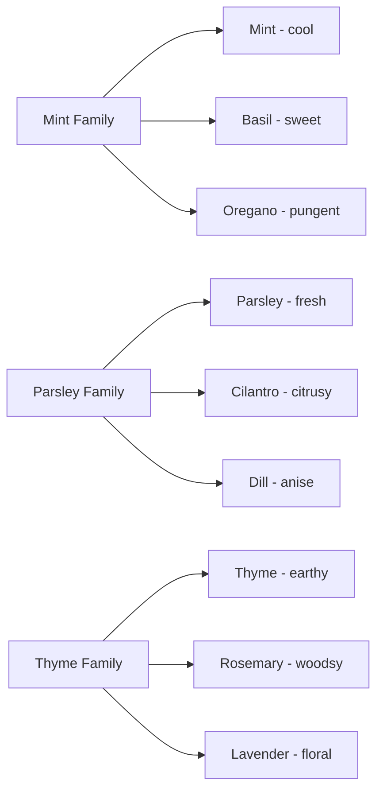
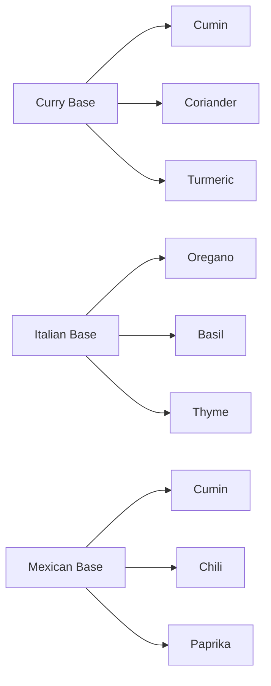

---
type: index
domain: Gastronomy
category:
- Herbs & Spices
created: 2026-04-21
modified: 2026-04-21
tags:
- ingredients
- herbs
- spices
- seasonings
- flavor-building
related:
- - Gastronomy/Concepts/Aromatics
  - Aromatics
status: complete
---


# Herbs & Spices

## Overview

This section provides a comprehensive reference for culinary herbs and spices, organized by type, flavor profile, culinary applications, and regional usage. Understanding herbs and spices is fundamental to developing flavor mastery across cuisines.

## Quick Reference Guide

### Essential Herbs (Fresh)

| Herb | Flavor Profile | Primary Cuisines | Best Uses | Storage |
|------|---------------|------------------|-----------|---------|
| **Basil** | Sweet, peppery, anise | Italian, Thai, Vietnamese | Pesto, salads, stir-fries | Refrigerate, stems in water |
| **Cilantro/Coriander** | Citrusy, bright, soapy | Mexican, Indian, Thai | Salsas, curries, garnish | Refrigerate |
| **Mint** | Cool, refreshing, sweet | Middle Eastern, Indian, Thai | Chutneys, drinks, garnish | Refrigerate |
| **Parsley** | Fresh, grassy, mild | Mediterranean, European | Garnish, bases, salads | Refrigerate |
| **Rosemary** | Piney, woodsy, strong | Mediterranean, French | Roasts, meats, potatoes | Refrigerate/dry |
| **Thyme** | Earthy, floral, minty | French, Mediterranean | Stews, soups, roasted meats | Refrigerate/dry |
| **Oregano** | Pungent, earthy, bitter | Italian, Greek, Mexican | Pizza, sauces, meats | Refrigerate/dry |

### Essential Spices (Dry)

| Spice | Flavor Profile | Primary Cuisines | Best Uses | Shelf Life |
|-------|---------------|------------------|-----------|------------|
| **Cumin** | Earthy, nutty, warm | Mexican, Indian, Middle Eastern | Chili, curries, tacos | 1-2 years |
| **Coriander** | Citrusy, floral, sweet | Indian, Mexican, Middle Eastern | Curry blends, pickling | 1-2 years |
| **Turmeric** | Earthy, bitter, warm | Indian, Thai, Caribbean | Curries, golden milk, pickling | 1-2 years |
| **Cinnamon** | Sweet, woody, warm | Middle Eastern, baking, desserts | Baking, coffee, savory dishes | 2-3 years |
| **Paprika** | Smoky, sweet, mild | Hungarian, Spanish, Mexican | Rubs, garnishes, stews | 1-2 years |
| **Black Pepper** | Pungent, sharp, woody | Global use | Seasoning, finishing | 2-3 years |
| **Cardamom** | Floral, citrusy, aromatic | Indian, Middle Eastern, Scandinavian | Coffee, curries, desserts | 1-2 years |

## Navigation

### Herbs by Category
- [[Herbs & Spices/Herbs/Fresh Herbs]] - Fresh herbs used for garnish and flavor
- [[Herbs & Spices/Herbs/Dried Herbs]] - Dried herbs for cooking and infusions
- [[Herbs & Spices/Herbs/Herb Blends]] - Pre-mixed herb combinations

### Spices by Category
- [[Herbs & Spices/Spices/Whole Spices]] - Spices used whole (seeds, pods, bark)
- [[Herbs & Spices/Spices/Ground Spices]] - Pre-ground spices for convenience
- [[Herbs & Spices/Spices/Spice Blends]] - Traditional spice mixtures

### Regional Spice Systems
- [[Herbs & Spices/Regional/Chinese Five-Spice]] - Chinese aromatic blend
- [[Herbs & Spices/Regional/Indian Garam Masala]] - Indian warming spice blend
- [[Herbs & Spices/Regional/French Herbs de Provence]] - French herb mixture
- [[Herbs & Spices/Regional/Mexican Mole]] - Mexican complex spice blend
- [[Herbs & Spices/Regional/Middle Eastern Ras el Hanout]] - North African spice blend

### Culinary Applications
- [[Herbs & Spices/Applications/Infusions]] - Teas, oils, vinegars
- [[Herbs & Spices/Applications/Rubs & Pastes]] - Dry rubs, wet pastes
- [[Herbs & Spices/Applications/Marinations]] - Flavor infusion techniques
- [[Herbs & Spices/Applications/Garnishes]] - Fresh herb finishing

## Learning Path

### Beginner
1. Start with **10 essential spices**: salt, pepper, cumin, paprika, cinnamon, turmeric, garlic powder, onion powder, oregano, chili powder
2. Master **5 fresh herbs**: parsley, cilantro, basil, mint, rosemary
3. Learn basic **flavor building** with aromatics (already covered in Aromatics)

### Intermediate
1. Explore **regional spice blends** (garam masala, five-spice, herbs de provence)
2. Master **toast and grind** techniques for fresh spices
3. Learn **herb preservation** methods
4. Understand **flavor layering** with timing

### Advanced
1. Create **custom spice blends** for specific cuisines
2. Master **infusion techniques** for oils, vinegars, alcohols
3. Understand **seasonal herb usage** and pairings
4. Learn **historical context** of spice trade and regional cuisines

## Quick Start: 5 Essential Spice Blends

### 1. Italian Spice Blend
```yaml
Ingredients:
- Dried oregano: 2 tsp
- Dried basil: 1 tsp
- Dried rosemary: 1 tsp (crumbled)
- Dried thyme: 1 tsp
- Garlic powder: 1 tsp
- Black pepper: 1/2 tsp
Uses: Pasta, pizza, roasted vegetables
```

### 2. Mexican Spice Blend
```yaml
Ingredients:
- Cumin: 2 tsp
- Chili powder: 2 tsp
- Paprika: 1 tsp
- Oregano: 1 tsp
- Garlic powder: 1 tsp
- Onion powder: 1 tsp
Uses: Tacos, beans, grilled meats
```

### 3. Indian Curry Powder
```yaml
Ingredients:
- Coriander: 2 tsp
- Cumin: 2 tsp
- Turmeric: 1 tsp
- Cayenne: 1/2 tsp (adjust for heat)
- Garam masala: 1 tsp
- Black pepper: 1/2 tsp
Uses: Curries, rice dishes, lentils
```

### 4. Middle Eastern Za'atar
```yaml
Ingredients:
- Dried thyme: 2 tsp
- Sesame seeds: 1 tsp
- Sumac: 1 tsp
- Salt: 1/2 tsp
Optional: Dried oregano, cumin
Uses: Flatbreads, dips, roasted vegetables
```

### 5. Chinese Five-Spice
```yaml
Ingredients:
- Star anise: 1 pod (crushed)
- Sichuan peppercorns: 1 tsp
- Cloves: 3-4 (crushed)
- Cinnamon: 1 tsp
- Fennel seeds: 1 tsp
Uses: Braised meats, stir-fries, duck
```

## Storage & Freshness

### General Rules
- **Whole spices** last 2-3 years (grind fresh for best flavor)
- **Ground spices** last 1-2 years (lose potency quickly)
- **Fresh herbs** last 3-7 days (refrigerate properly)
- **Store away from heat, light, moisture**

### Reviving Stale Spices
- **Toast whole spices** in dry pan 1-2 minutes until fragrant
- **Grind just before use** with mortar and pestle or spice grinder
- **Freeze fresh herbs** in ice cube trays with oil or water

## Flavor Compatibility Charts

### Herbs by Flavor Profile


### Spice Pairings


## Practice Ideas

### Weekly Projects
1. **Spice Blend Sunday** - Create 1 custom spice blend per week
2. **Fresh Herb Monday** - Use 3 different fresh herbs in dishes
3. **Toast & Grind Tuesday** - Toast whole spices for maximum flavor
4. **Regional Spice Day** - Cook dishes from different spice regions
5. **Herb Preservation** - Make herb oils, vinegars, or freezer cubes

### Monthly Challenges
- **Herb Garden Project** - Grow 5 culinary herbs
- **Spice Collection Audit** - Organize and refresh your spice cabinet
- **International Spice Tour** - Cook 4 dishes from different spice regions
- **Custom Blend Creation** - Develop signature spice/herb blends

## Related Content
- [[Gastronomy/Concepts/Aromatics]] - Base flavor building techniques
- [[Gastronomy/Cuisines]] - Regional cuisine guides with specific spice usage
- [[Local Interests/Gardening]] - Growing your own herbs and spices

---
*Created: 2026-04-21 | Next: Create individual herb and spice pages*
---
