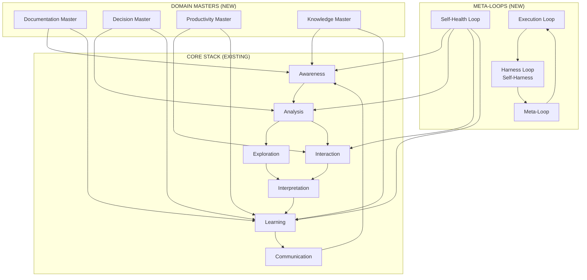

# Hermes Architecture Extension: Domain Masters & Learning Loops

> Consolidated reference for the Jul 15 architectural extension. Cross-links to 6 individual concept pages. Source: [[p6-hermes-architecture-layers-domain-masters]].

## The Missing Layers Problem

The Hermes Agent Cognitive Stack (AWARENESS → ANALYSIS → EXPLORATION → INTERACTION → INTERPRETATION → LEARNING → COMMUNICATION) captures **operational flow** but omits two critical capabilities:

1. **Domain-specialized governance** — vertical specialists that bring deep domain knowledge to bear on specific task categories
2. **Self-regulation mechanisms** — meta-layers that monitor system health and drive autonomous improvement

This extension adds both, in the form of **Domain Masters** (4 vertical specialists) and two **meta-loops** (Self-Health Loop + Learning Loop).

## Domain Masters (Layer Type A)

Domain masters are dedicated cognitive layers that specialize in specific knowledge domains, operating as semi-autonomous sub-systems within the main agent stack.

### Documentation Master

**Purpose:** Curates, organizes, and maintains all technical and process documentation.

- Tracks documentation freshness (last updated, broken links)
- Generates docs from code/README files
- Maintains living corpus feeding into Awareness stage
- **Health signals:** `coverage_score`, `stale_threshold`, `link_health`, `doc_debt`

→ Full page: [[documentation-master]]

### Decision Master

**Purpose:** Structured decision-making, decision provenance tracking, and decision hygiene enforcement.

- Applies pre-mortem + black swan analysis before major changes
- Maintains decision log: `{id, context, options, choice, rationale, outcome}`
- Veto authority on high-risk tool calls
- **Health signals:** `open_decisions`, `pending_premortems`, `accuracy_rate`, `decision_latency`

→ Full page: [[decision-master]]

### Productivity Master

**Purpose:** Optimizes workflow efficiency, manages task abstraction layers, tracks operational leverage.

- Monitors skill usage patterns and effectiveness
- Manages abstraction debt: `Σ(complexity_gained × leverage_added⁻¹)`
- Identifies parallelization opportunities + bottlenecks
- **Self-improvement triggers:** success_rate < 50%, completion > 2× avg, unused 30+ days

→ Full page: [[productivity-master]]

### Knowledge Master

**Purpose:** Governs the complete knowledge lifecycle: ingestion, synthesis, validation, retirement.

- Oversees gbrain indexing (20,226 pages, 86,007 links as of Jul 2026) and quality
- Manages 4-tier memory system (HOT/WARM/COOL/COLD)
- Enforces knowledge freshness policies
- **Health signals:** `brain_size`, `orphan_ratio` (<10%), `connectivity_score` (>90%), `source_freshness` (<30d)

→ Full page: [[knowledge-master]]

## Self-Health Loop (Meta-Layer 1)

Continuously monitors system health and initiates self-repair without human intervention.

**Three-tier repair:**
- **Tier 1 (Automatic):** MCP reconnect, browser fallback, memory auto-tiering, cron restart
- **Tier 2 (Semi-automatic):** Skill patch proposals, knowledge re-ingestion, doc regeneration
- **Tier 3 (Escalated):** Model provider alerts, emergency patches, human-mediated reset

**Valid stopping conditions** (not "health check passed"): all critical services responding, memory hit rate > threshold for 3 checks, skill error rate < 15% for 7 days.

→ Full page: [[self-health-loop]]

## Learning Loop (Meta-Layer 2)

Formalizes continuous improvement following the enhanced Self-Harness methodology (arXiv:2606.09498).

**Three-layer architecture:**
```
Meta-Loop   → Optimizes the improvement loop itself
Harness Loop → Weakness mining → Proposal generation → Validation
Execution Loop → Primary agentic workflow (the cognitive stack)
```

**Learning signals weighted by impact:**
- Task success / user corrections: α=1.0 (highest signal)
- Decision accuracy: α=0.9
- Skill error rate: α=0.8
- Memory hit quality: α=0.7
- Abstraction debt: α=0.6
- Knowledge growth: α=0.5

→ Full page: [[learning-loop]]

## Integration with Existing Hermes Stack

| New Layer | Maps To | Existing Component |
|:----------|:--------|:-------------------|
| Documentation Master | Awareness + Learning | wiki-personal, read-the-damn-docs skill |
| Decision Master | Analysis + Communication | premortem skill, quick-recap |
| Productivity Master | Interaction + Learning | skill system, abstraction tracking |
| Knowledge Master | Awareness + Interpretation | gbrain, wiki/knowledge-management |
| Self-Health Layer | All stages (monitor) | health check cron, cron-failure-watchdog |
| Learning Loop | All stages (feedback) | Memory.md, skill patches |

## Architectural Diagram



## Implementation Roadmap

| Phase | Scope | Status |
|:------|:------|:-------|
| **P0: Foundation** | Create domain master stubs, extend state file, integrate health checks into daily brief | ✅ Concept pages created (Jul 15) |
| **P1: Loop Integration** | Connect Self-Harness feedback to skill patches, add learning signal tracking, implement domain master state persistence | 🟡 In progress |
| **P2: Specialization** | Documentation Master automation, Decision Master pre-mortem enforcement, Productivity Master metrics | ⬛ Not started |
| **P3: Autonomous Evolution** | Full Self-Harness loop for domain masters, autonomous skill subspace encoding, LoRA adapter training from traces | ⬛ Not started |

## Open Questions for Synthesis

1. **Domain master / skill interaction** — Should they be special skill categories or orthogonal layers?
2. **Self-Harness generalization** — Can it work for non-coding tasks (Terminal-Bench → decision-making)?
3. **Negative feedback loop prevention** — How to stop vanity metric optimization?
4. **Knowledge graph health metrics** — Beyond orphan ratio and connectivity, what matters?

> Synthesis outputs: see [[p6-architecture-extension-synthesis]] (pending NotebookLM run)

## Related Pages

- [[hermes-agent-stack]] — Core 7-stage cognitive stack
- [[loop-engineering]] — 6-component autonomous loop design
- [[self-harness-paradigm]] — Three-stage improvement methodology
- [[memory-tiering]] — 4-tier memory architecture
- [[documentation-master]] · [[decision-master]] · [[productivity-master]] · [[knowledge-master]]
- [[self-health-loop]] · [[learning-loop]]
